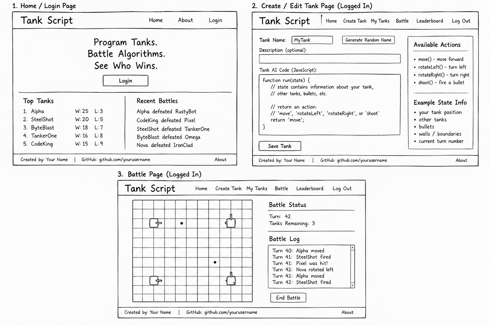

# TankScript

[My Notes](notes.md)

TankScript is a web-based programming game where users create JavaScript algorithms to control tanks and compete against tanks programmed by other users.

### Elevator pitch

TankScript is a competitive programming game where you don't control your tank—you program it. Players create JavaScript algorithms that determine how their tanks move, aim, and attack, then send them into a live 2D arena against tanks created by other players. Battles play out automatically in real time, while wins and losses build each tank's place on the leaderboard.

### Design

The application will have several main views, including a home/login page, a tank programming page, a battle arena, and a leaderboard.

The tank editor will allow users to create a tank, give it a name, and write the JavaScript algorithm that controls its behavior.

The battle arena will display a 2D grid containing the competing tanks. As the simulation runs, users will be able to watch tanks move, rotate, and fire in real time.

### Key features

- Register, log in, and log out of an account.
- Create and name programmable tanks.
- Write JavaScript algorithms that control a tank's decisions.
- Save and edit tank programs.
- Select tanks and run battles between them.
- Watch tank battles play out on a 2D grid.
- Allow tanks to move, rotate, and shoot based on their programmed algorithms.
- Track wins and losses for tanks.
- View a leaderboard of tanks created by different users.
- Watch battles update in real time.

### Technologies

I am going to use the required technologies in the following ways.

- **HTML** - Provides the basic structure of the application, including the login interface, navigation, tank editor, battle arena, tank information, and leaderboard.
- **CSS** - Styles the application and makes it responsive to different screen sizes. CSS will also be used to visually represent the battle grid, tanks, bullets, directions, and animations such as tanks moving and firing.
- **React** - Provides reusable components for parts of the application such as the tank editor, battle arena, tank cards, login interface, and leaderboard. React routing will switch between the application's different views, and React will update the interface as users edit tanks and watch battles.
- **Service** - The backend service will provide endpoints for registering, logging in, and logging out users. It will also provide application-specific endpoints for creating, retrieving, updating, and deleting tanks, retrieving leaderboard information, and starting or retrieving battles. When a user creates a tank, the application will use the [CueName Fantasy Name Generator API](https://cuename.com/developers) to optionally generate a random name for the tank.
- **DB/Login** - The database will persist user accounts and authentication information as well as application data such as saved tanks, tank programs, wins, losses, and battle results.
- **WebSocket** - When a battle is running, the server will send battle updates to connected clients using WebSocket. These updates will allow users watching a battle to see tank movement, rotation, shooting, damage, and battle results in real time.

## 🚀 Specification Deliverable

> [!NOTE]
> Fill in this sections as the submission artifact for this deliverable. You can refer to this [example](https://github.com/webprogramming260/startup-example/blob/main/README.md) for inspiration.

For this deliverable I did the following. I checked the box `[x]` and added a description for things I completed.

- [x] **I completed the prerequisites for this deliverable** - I completed the required prerequisite work and committed my startup specification to Git.
- [x] **Proper use of Markdown** - I used headings, lists, links, images, and other Markdown formatting throughout my README.
- [x] **A concise and compelling elevator pitch** - I created an elevator pitch describing TankScript and its competitive programming concept.
- [x] **Description of key features** - I documented user accounts, programmable tanks, battles, saved tanks, leaderboards, and realtime battle updates.
- [x] **Description of how I will use each technology** - I described my planned use of HTML, CSS, React, backend services, authentication, the CueName third-party API, database storage, and WebSocket.
- [x] **Rough sketches of the application** - I created and embedded a design showing the planned home/login page, tank editor, and battle arena.

## 🚀 AWS deliverable

For this deliverable I did the following. I checked the box `[x]` and added a description for things I completed.

- [x] **Rented EC2 server** - I created and rented my own EC2 server from AWS.
- [x] **Leased domain name** - I used Route 53 to rent a domain name.
- [x] **Server accessible** from my domain: [https://HaddenSmith.com](https://HaddenSmith.com) - The webpage is published and secure.

## 🚀 HTML deliverable

For this deliverable I did the following. I checked the box `[x]` and added a description for things I completed.

- [x] I completed the prerequisites for this deliverable (Simon deployed, GitHub link, Git commits).
- [x] **HTML pages** - I created separate HTML pages for the major components of TankScript, including Home, Login, Tank Editor, Battle, and About.
- [x] **Proper HTML element usage** - I used semantic HTML elements including `body`, `header`, `nav`, `main`, `section`, and `footer` to organize the application.
- [x] **Links** - I added consistent navigation links between all of the application pages, along with a prominent link to my GitHub repository.
- [x] **Text** - I added application content explaining TankScript, how the game works, and the basic workflow for creating and battling programmed tanks.
- [x] **3rd party API placeholder** - I added a Tank Name Assistant placeholder to the Tank Editor page to represent a future third-party service integration.
- [x] **Images** - I included my TankScript application image on the Home and About pages.
- [x] **Login placeholder** - I created a Login page with username/email and password inputs, a login button, account registration placeholder, and a placeholder for displaying the authenticated user's name.
- [x] **DB data placeholder** - I added placeholders for database-backed tank information on the Tank Editor page and battle history on the Battle page.
- [x] **WebSocket placeholder** - I added a live battle event area on the Battle page to represent future realtime WebSocket communication for tank movements, shots, hits, and battle events.

## 🚀 CSS deliverable

For this deliverable I did the following. I checked the box `[x]` and added a description for things I completed.

- [x] I completed the prerequisites for this deliverable (Simon deployed, GitHub link, Git commits).
- [x] **Visually appealing colors and layout. No overflowing elements.** - I created a consistent Blueprint Programmer color scheme with blue, teal, light gray, and dark console colors, and tested the layout at different screen sizes.
- [x] **Use of a CSS framework** - I added Bootstrap 5.3.3 and used Bootstrap classes for form controls and buttons while keeping my custom TankScript styling.
- [x] **All visual elements styled using CSS** - I styled the navigation, footer, typography, links, page spacing, buttons, forms, and other visual elements with shared and page-specific CSS.
- [x] **Responsive to window resizing using flexbox and/or grid display** - I used Flexbox, Grid, and media queries to make the navigation, footer, and page layouts adapt to smaller screens.
- [x] **Use of a imported font** - I imported Chakra Petch and JetBrains Mono from Google Fonts and used them throughout the TankScript interface.
- [x] **Use of different types of selectors including element, class, ID, and pseudo selectors** - I used element, class, ID, child, and pseudo selectors such as `:hover` and `:focus-visible` throughout the stylesheet.

## 🚀 React part 1: Routing deliverable

For this deliverable I did the following. I checked the box `[x]` and added a description for things I completed.

- [ ] I completed the prerequisites for this deliverable (Simon deployed, GitHub link, Git commits)
- [ ] **Bundled using Vite** - I did not complete this part of the deliverable.
- [ ] **Components** - I did not complete this part of the deliverable.
- [ ] **Router** - I did not complete this part of the deliverable.

## 🚀 React part 2: Reactivity deliverable

For this deliverable I did the following. I checked the box `[x]` and added a description for things I completed.

- [ ] I completed the prerequisites for this deliverable (Simon deployed, GitHub link, Git commits)
- [ ] **All functionality implemented or mocked out** - I did not complete this part of the deliverable.
- [ ] **Hooks** - I did not complete this part of the deliverable.

## 🚀 Service deliverable

For this deliverable I did the following. I checked the box `[x]` and added a description for things I completed.

- [ ] I completed the prerequisites for this deliverable (Simon deployed, GitHub link, Git commits)
- [ ] **Node.js/Express HTTP service** - I did not complete this part of the deliverable.
- [ ] **Static middleware for frontend** - I did not complete this part of the deliverable.
- [ ] **Calls to third party endpoints** - I did not complete this part of the deliverable.
- [ ] **Backend service endpoints** - I did not complete this part of the deliverable.
- [ ] **Frontend calls service endpoints** - I did not complete this part of the deliverable.
- [ ] **Supports registration, login, logout, and restricted endpoint** - I did not complete this part of the deliverable.
- [ ] **Uses BCrypt to hash passwords** - I did not complete this part of the deliverable.

## 🚀 DB deliverable

For this deliverable I did the following. I checked the box `[x]` and added a description for things I completed.

- [ ] I completed the prerequisites for this deliverable (Simon deployed, GitHub link, Git commits)
- [ ] **Stores data in MongoDB** - I did not complete this part of the deliverable.
- [ ] **Stores credentials in MongoDB** - I did not complete this part of the deliverable.

## 🚀 WebSocket deliverable

For this deliverable I did the following. I checked the box `[x]` and added a description for things I completed.

- [ ] I completed the prerequisites for this deliverable (Simon deployed, GitHub link, Git commits)
- [ ] **Backend listens for WebSocket connection** - I did not complete this part of the deliverable.
- [ ] **Frontend makes WebSocket connection** - I did not complete this part of the deliverable.
- [ ] **Data sent over WebSocket connection** - I did not complete this part of the deliverable.
- [ ] **WebSocket data displayed** - I did not complete this part of the deliverable.
- [ ] **Application is fully functional** - I did not complete this part of the deliverable.
